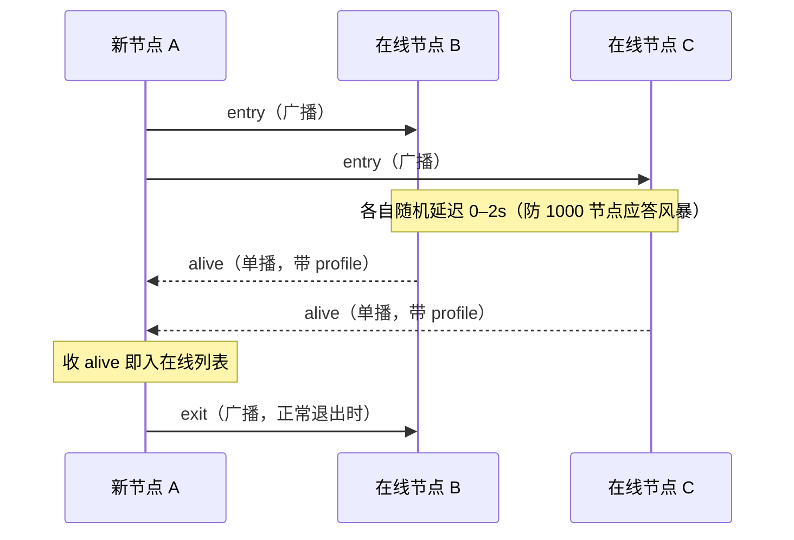
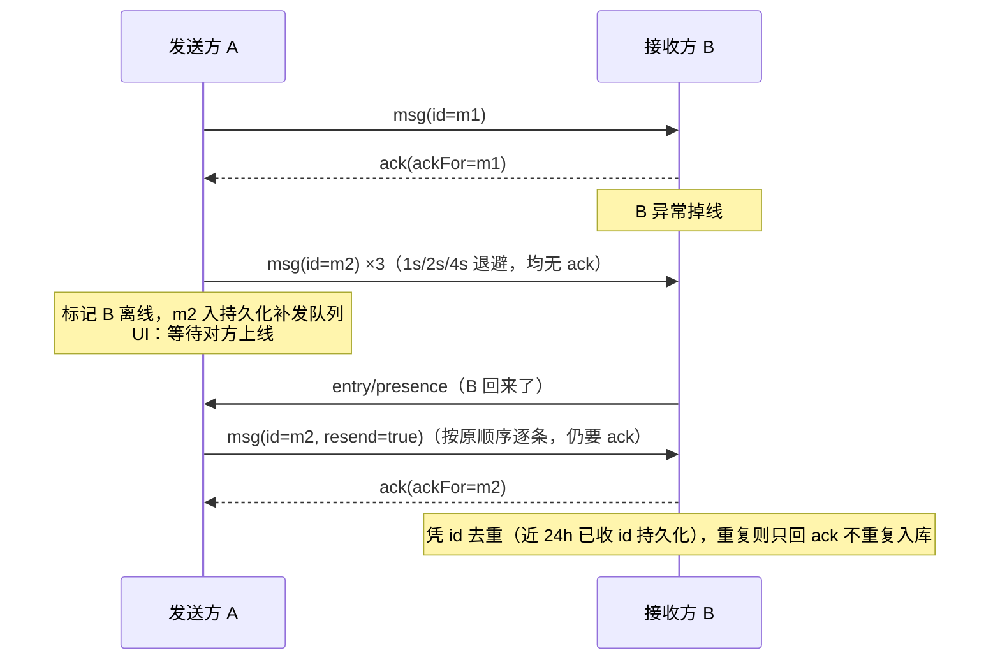
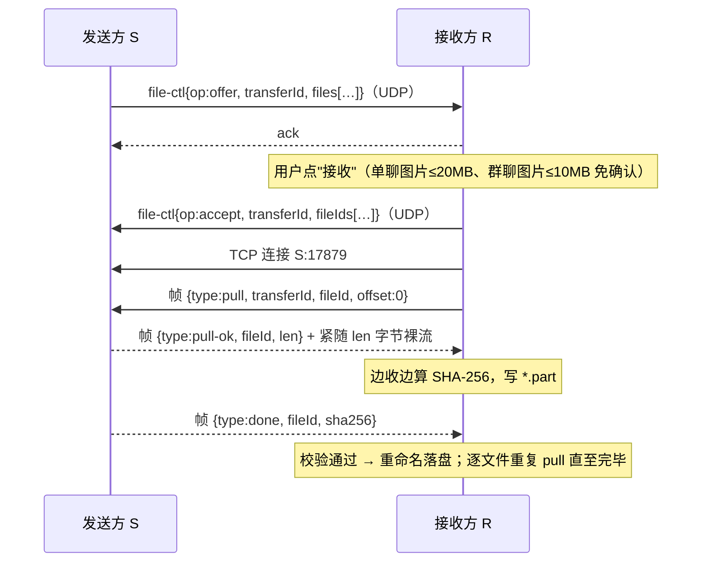
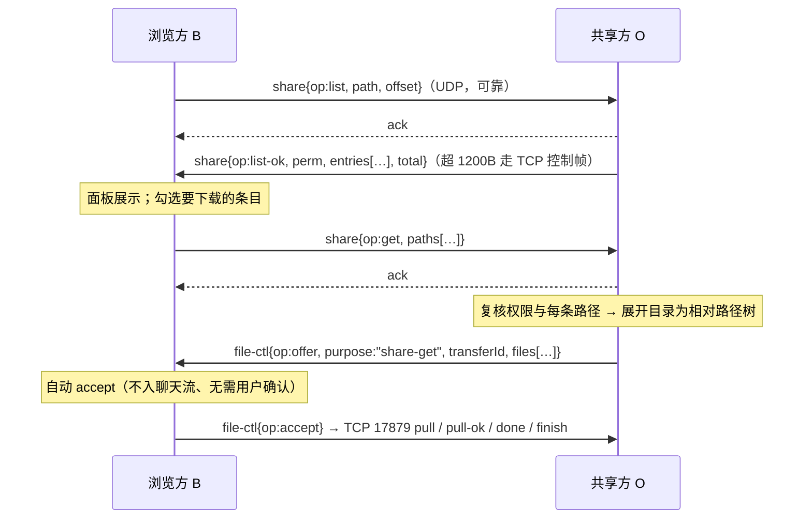
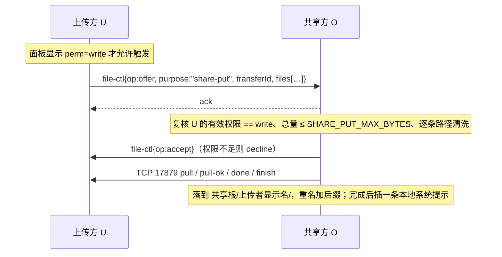

# 茶话间（Teahouse）协议设计文档

> [简体中文](protocol.md) · [English](en/protocol.md)

| | |                                                                                                                                                                                                                                    |
|---|---|------------------------------------------------------------------------------------------------------------------------------------------------------------------------------------------------------------------------------------|
| 状态 | 主协议保持自有 JSON 与信封 `v:1`；v0.58.0 新增只读屏幕会话（#310）                                                                                                                                                   |
| 日期 | 2026-09-16（#310 已实现 `screen`、`rv1/rvs1` 及单帧 JPEG 流） |
| 关系 | 本文是**茶话间主协议**的唯一事实来源；功能取舍依据 [requirements.md](requirements.md)（决议 #5：借鉴 ipmsg/iptux 机制、主协议报文自有、不加密；决议 #194/#195：内网通兼容模式走独立适配器，并在适配器内评估文件 / 图片 / 震动能力） |

## 1. 设计原则

1. **机制照搬成熟做法**：UDP 广播发现、UDP+ACK 可靠消息、TCP 拉取式文件传输——与 ipmsg/iptux 同构，实现时可对照 `references/ipmsg/protocol.txt` 与 `references/iptux/src`。
2. **主协议报文自有**：茶话间节点之间只使用 UTF-8 JSON，主协议不引入 GBK/SJIS，也不把 IPMSG 文本报文混入 `UdpChannel` / `codec`；内网通兼容模式由独立适配器处理，见 [nwt-compat-design.md](nwt-compat-design.md)。
3. **对等无服务器**：任何节点崩溃/离线不影响其余节点；协议必须容忍丢包、乱序、重复、节点随时消失。
4. **可演进**：信封带版本号；收到未知 `type` 或未知字段一律忽略不报错（向前兼容的基础）。
5. **内网信任模型**：不加密、不签名（决议 #5），但**所有入站报文按不可信输入做校验**（长度、类型、字段白名单）。
6. v1 仅 IPv4，IPv6 远期（决议 #3）。

## 2. 传输层总览

| 通道 | 传输 | 默认端口 | 承载 |
|---|---|---|---|
| 控制/消息 | UDP（广播 + 单播） | 17878 | 发现、心跳、资料、gossip、短消息、ACK、文件控制 |
| 数据 | TCP | 17879 | 文件/图片字节流、头像响应、长消息、批量补发 |

- UDP 单包载荷上限 **1200 字节**（避免 IP 分片）；装不下的内容一律走 TCP。
- 两个端口默认值已拍板（决议 #6），可在设置中修改，全网节点须一致。
- 多网卡：默认向**所有非回环 IPv4 接口**发广播、全接口监听；设置中可绑定指定网卡（虚拟网卡多的办公机需要，决议 #4）。

## 3. 节点标识与资料

- **nodeId**：首次启动 `crypto.randomUUID()` 生成，本地持久化。昵称、IP、主机名怎么变，**身份和会话历史都跟着 nodeId 走**。
- 同机多实例：v1 不支持（端口独占即天然互斥）。
- 节点资料（profile）结构，随 `entry` / `alive` / `profile` 报文携带：

```jsonc
{
  "nodeId":  "0d1f…",          // UUID
  "nick":    "张三",            // ≤ 32 字符
  "company": "某某科技",        // ≤ 32 字符，可空 → 通讯录归"未分组"
  "dept":    "研发部",          // ≤ 32 字符，可空
  "team":    "后端组",          // ≤ 32 字符，可空（公司 ▸ 部门 ▸ 团队 三级）
  "avatar":  3,                 // 头像模板编号；-1=旧昵称色块；0..199=背景色*20+动物；200..209=昵称首字背景色
  "profileRev": 7,              // 资料版本号，每次修改 +1；心跳携带，用于失配刷新
  "ver":     "0.1.0",           // 应用版本；"发现内网更高版本时提示"的依据（P2）
  "host":    "zhangsan-PC",
  "platform":"win|mac|linux",
  "tcpPort": 17879,
  "caps":    ["grp1","img1"]    // 能力声明，供未来扩展探测
}
```

**caps 能力位**（短串，入站按 `LIMITS.capItem` 截断、未知位忽略）：`grp1` 群聊、`img1` 图片消息、**`av1` 自定义头像**（决议 #243，理解资料/群元数据头像哈希与 `avatar` 按需取图）、**`mrec1` 媒体撤回**（决议 #188，支持 `file-ctl offer.msgId` 与图片 / 未完成文件撤回）、**`tbl1` 表格图片文字视图**（决议 #190，支持 `file-ctl offer.tableText/tableTextTruncated`，图片气泡可在图片 / 原始 TSV 文本间切换）、**`fd1` 私聊文件直接发送**（决议 #174，支持接收 `file-ctl {op:"direct"}` 并按本地策略自动 accept）、**`tw1` 传输排队与可恢复取消**（决议 #211，支持接收 TCP `wait` 帧；作为发送方时收到对端 cancel 后保留供流授权，允许接收方此后凭原 transferId 断点重拉）、**`shr1` 共享文件柜**（决议 #271/#275，支持 `share` 报文的 `list/list-ok/get/deny` 与 `file-ctl offer.purpose:"share-get"|"share-put"`）——只声明能力，**不代表已开共享**：是否可见、可下载、可上传一律由共享方本机按"默认档 + 按人例外"当场判定，未声明者按未知类型忽略 `share` 报文，新端对其灰显文件柜入口并拒收其 `purpose:"share-*"` offer、**`upd1` 可作为本平台更新源**（决议 #166/#170/#181）——声明者运行于可分发形态（Windows nsis 安装版可自留安装器、Linux deb 可经 `dpkg-deb` 自重打包），且本机已有可提供的本平台安装包，能向同平台、同架构、版本更低的节点提供安装包；形态不可分发 / 尚未备妥包时不声明。绿色版（portable / AppImage）机制上同样适用，本期实现聚焦 nsis / deb。

## 4. 报文信封（UDP 与 TCP 控制帧通用）

```jsonc
{
  "v":    1,            // 协议版本，整数
  "type": "msg",        // 报文类型，见 §5
  "id":   "uuid",       // 本报文唯一 ID（去重、ACK 引用的对象）
  "from": "nodeId",
  "ts":   1780000000000, // 发送方 unix 毫秒
  "payload": { }
}
```

兼容规则：`v` 相同主版本必须互通；未知 `type`/未知字段忽略；缺必填字段的报文丢弃并计数（不回错误，防放大）。

## 5. 报文类型一览

| type | 方向 | 通道 | 用途 |
|---|---|---|---|
| `entry` | 广播/单播 | UDP | 上线宣告（带 profile） |
| `alive` | 单播 | UDP | 对 `entry` 的应答（带 profile，随机延迟 0–2s 防风暴） |
| `exit` | 广播 | UDP | 正常下线 |
| `presence` | 广播 + 对跨网段已知节点单播 | UDP | 心跳 `{seq, profileRev}` |
| `profile` | 广播/单播 | UDP | 资料变更（昵称/公司/团队/头像） |
| `peers` | 单播 | UDP | gossip：已知节点摘要交换 |
| `scan-ranges` | 单播 | UDP | 低频同步扫描 CIDR 记录（不触发即时扫描） |
| `msg` | 单播 | UDP/TCP | 用户消息（kind 细分，见 §7） |
| `ack` | 单播 | UDP/TCP | `{ackFor: id}`，对 `msg` 与 `file-ctl` 的确认 |
| `file-ctl` | 单播 | UDP | 文件控制：offer / accept / decline / cancel / direct（`direct` 为发送方在私聊文件卡片上请求直接发送；`offer.purpose:"update"` 为自更新包，见 §8） |
| `update` | 单播 | UDP/TCP | 局域网自更新：可靠控制报文；`req` 请求对端发来其平台安装包（决议 #166/#170，见 §8） |
| `share` | 单播 | UDP/TCP | 共享文件柜控制：list / list-ok / get / deny（见 §8.2；`list-ok` 常超 UDP 上限，走既有 TCP 控制帧兜底） |
| `group` | 单播 | UDP | 群元数据：info / need（见 §7.4） |
| `avatar` | 单播 | UDP/TCP | 自定义头像按 SHA-256 请求 / 返回 / 无数据提示（见 §7.5） |

## 6. 发现、在线与跨网段

### 6.1 上线 / 应答 / 下线（对应 IPMSG 的 BR_ENTRY / ANSENTRY / BR_EXIT）



**批量开机风暴对策**（统一 VM 环境集中开机是常态，决议 #22）：① 应答抖动窗口按已知在线规模自适应——在线 <100 用 0–2s，每多 100 在线扩 1s，上限 0–8s；② 对 10s 内已互发过 `entry`/`alive` 的节点不重复应答；③ 入站 `entry` 处理排队削峰，处理不过来时丢弃靠 `presence` 周期自愈。

**源地址连续性**（决议 #132）：`entry` / `alive` / `profile` 的 `profile.nodeId` 必须等于信封 `from`，否则丢弃；已在线节点的 nodeId 只接受当前记录的 IP+UDP 端口来源，来自不同 UDP 源地址的同 nodeId 报文不更新资料、不改绑地址。离线历史节点换地址必须重新携带完整 profile 完成 `entry`/`alive` 握手后才可更新。

### 6.2 心跳与离线判定（IPMSG 没有，我们补上）

- 每 **30s** 广播一次 `presence`；对**不在本网段**的已知在线节点，同周期批量单播（限速）。
- `presence` 携带 `profileRev`（资料版本号）：收端发现与本地缓存版本不一致 → 单播 `entry`，对方按 §6.1 回 `alive`（带全量资料）即完成刷新。零新增报文类型，最迟一个心跳周期内纠正"机器没换、用的人换了"的资料漂移（需求 F-DISC-7）。
- **90s**（3 个周期）收不到某节点任何报文 → 标记离线。
- **按需探活（在线二次校验）**：打开与某节点的会话时，立即向其单播 `entry`（对方回 `alive`），约 **2s** 未应答即在 UI 转为离线——弥补 90s 心跳窗口期的"假在线"，防止对着掉线的人发消息（需求 F-DISC-8，决议 #16）。
- 消息连续重传失败（§7.2）→ 立即标记离线并转入补发队列，不等心跳超时。
- 手动"刷新列表" = 重新走一遍 6.1 + 6.3。

### 6.3 跨网段发现（三板斧，对应需求 F-DISC-2）

1. **手动节点**：对用户填的 IP / 导入列表逐个单播 `entry`，收到 `alive` 即建立联系。
2. **网段扫描**：对配置的 CIDR（如 `10.1.0.0/24`）限速单播 `entry`（≤ 128 地址/秒），无应答地址不重试（手动触发才扫）。
3. **gossip 散播**：**结识即交换**（首次得知某节点在线时，把自己已知的在线节点摘要单播给它）+ 每 5 分钟向随机 2 个在线节点周期交换，报文为 `peers`：

```jsonc
{ "peers": [ { "nodeId": "…", "ip": "10.2.0.8", "tcpPort": 17879, "lastSeen": 1780000000000 } ] }
```

   收到 `peers` 后，对**陌生且 lastSeen < 10 分钟**的条目单播 `entry` 验证，**收到 `alive` 才入列表**（不直接信任转述，防列表投毒）。跨网段只要存在一个双网段可达的"桥"节点，全网即可打通——内网通同思路。`peers` 超出 UDP 载荷时拆多条发送（同 §8 offer 的拆包约定）。

- **节点缓存**：已知节点（nodeId, ip, tcpPort, lastSeen）持久化；启动时除广播外，对缓存中 7 天内活跃的节点单播 `entry`，加速跨网段在线列表重建。

### 6.4 扫描范围低频分享（决议 #114）

网段范围分享只同步“配置候选”，不代表收端马上扫描。新增报文 `scan-ranges`，由已在线节点间单播低频交换：

```jsonc
{ "ranges": [ { "cidr": "10.1.2.0/24", "addedAt": 1780000000000 } ] }
```

- 出站：启动后随机延迟 2–10 分钟分享一次，之后每 60 分钟兜底分享；本机手动新增扫描网段后只安排一次抖动分享，不立即群发。
- 入站校验：只接受合法 IPv4 CIDR，且展开主机数不得超过 1024（最大 /22）；每包最多 10 个网段；未知字段忽略。
- 合并：收端只新增本机没有、且未被用户忽略的网段记录，并保存来源 nodeId / 显示名 / addedAt；远端不能删除、覆盖或修改本机已有记录。
- 扫描：收到新网段后进入本机后台扫描队列，首次随机延迟 30–90 分钟；同一自动同步网段最短 12 小时扫一次；在线节点数超过 50 时，按 `(self nodeId + cidr)` 的稳定 hash 抽样，默认约 10% 节点参与扫描，其他节点继续依赖 `peers` gossip 学到结果。
- 手动扫描：用户在设置页点击“扫描/再次扫描”仍按 §6.3 的手动路径立即限速扫描，不受后台队列节流影响。
- 忽略：用户删除同步来的网段后，本机写入忽略表；后续再次收到相同 CIDR 不自动加回。用户自己手动新增相同 CIDR 时清除忽略。

## 7. 消息通道

### 7.1 消息报文

`msg.payload`：

```jsonc
{
  "kind": "text",        // text | group-text | recall | nudge | pk
  "text": "你好",         // kind=text/group-text；UTF-8，UDP 装不下走 TCP
  "groupId": "uuid",     // 仅 group-text / 群聊 pk
  "groupRev": 4,         // 仅 group-text / 群聊 pk，群元数据版本（见 §7.4）
  "mentions": ["nodeA"], // 仅 group-text 可选：被 @ 的成员 nodeId 列表
  "targetId": "uuid",    // 仅 recall：要撤回的原消息 id；媒体消息使用 offer.msgId
  "game": "dice",        // 仅 pk：dice | rps
  "result": 6,           // 仅 pk：dice=1..6；rps=rock|paper|scissors
  "resend": true,         // 文本 / 群文本 / 撤回补发标记（可选）；ts 保持原值；nudge/pk 不使用
  "replyTo": "uuid"      // 仅 group-text 可选：被引用的源消息 ID；接收端在本地群会话内查询后生成展示内容（senderName + 首行文本摘要）；codec 层只允许非空字符串，拒绝 {id,senderName,text} 等对象与空字符串（决议 #288）
}
```

- 文本 ≤ **800 字节**优先走 UDP，超过经 TCP 控制帧发送（同信封）。短文本若 UDP 三次退避仍无 `ack`，发送端可复用同一 TCP 控制帧兜底一次；TCP 仍失败才按离线补发处理（决议 #46）。
- 撤回：自己的文本 / 群文本 / PK / 图片 / 文件消息在 **5 分钟内**可发 `msg(kind:"recall", targetId)`（决议 #63/#139/#188，原 2 分钟）；群聊撤回额外携带 `groupId` / `groupRev`。收端仅接受"撤回者 = 原消息发送者"且会话匹配的指令，随后本地隐藏原消息并插入系统提示行（如"对方撤回了一条消息"）。撤回 PK 只隐藏目标 PK 消息，不级联影响之后别人另发的 PK。媒体撤回要求双方声明 `mrec1` 且对应 `file-ctl offer` 携带 `msgId`，收发两端用该 `msgId` 入库为同一消息 ID：图片可在窗口内撤回并隐藏；普通文件仅在本端尚未完成接收时接受撤回，收端须取消进行中的 TCP 拉取并清理 `.part`，已完成保存的文件必须忽略迟到撤回；群文件仅当目标消息关联的全部 transfer 均未完成时可被撤回。表情包本轮不开放用户可见撤回入口。撤回指令与普通消息一样走 ACK / 重传 / 离线补发；若与原消息乱序到达，收端短暂挂起撤回，待原消息入库后按上述规则应用。
- 私聊窗口震动：`msg(kind:"nudge")` 仅单聊使用，payload 除 `kind` 外不带正文、群字段或文件引用；它是可靠即时提醒动作。发送走可靠 ACK；若对端无响应则失败且**不进入离线补发队列**。发送成功后发送端写入本地 `system` 提示行；收端未限流时写入本地 `system` 提示行、唤起主窗并定位到 `single:<from>` 会话；若该单聊免打扰，收端不得唤起、置前或震动主窗。这些提示行不写 FTS，不改变线上载荷。收发两端均按同一对端限流：60 秒最多 2 次，且任意两次至少间隔 15 秒；收端超限时仍回 ACK，但丢弃本地震动动作与提示，防止重传放大骚扰（决议 #109/#110/#112）。
- PK 分歧解决：`msg(kind:"pk")` 用于骰子与猜拳（决议 #139）。`game` 取 `dice` 或 `rps`；`dice.result` 为整数 1–6，`rps.result` 为 `rock|paper|scissors`。每条 PK 都是独立消息，不使用回合关联字段，对方点击参与时也发送新的独立 `pk` 消息。结果由发送端主进程在发送瞬间生成并写入载荷；接收端不得重新随机，只播放本地动画并定格到载荷结果。PK 是在线即时娱乐：单聊只在对端在线时发送，群聊只向当时在线的其他成员逐个单播，不进入离线补发队列，payload 也不带 `resend`；发送失败后的重试必须复用同一 `msgId` 与同一 `result`，不得重新随机。通知 / 会话预览 / 历史搜索不得从线上摘要提前暴露结果；旧版本客户端不发送 fallback 文本，混用时按不支持 PK 处理。PK 不提供承诺揭示、签名或加密公平性证明。
- 群内 @：`group-text.mentions` 为可选 nodeId 数组，最多 50 个；收端若包含本机 nodeId，则会话列表本地标记"有人@我"，打开会话后清除。`mentions` 只影响提醒，不影响投递范围；投递仍按群成员列表逐个单播。
- 群聊引用回复（决议 #288）：发送侧的 `replyTo` 只携带源消息 ID；接收侧在同一群会话内按 ID 查询源消息，生成展示用的 `senderName`（备注优先、其次昵称）与首行文本摘要后写入 `ReplyMeta`（对象 `{id, senderName, text}`），本地消息 `messages.reply_to` 列存源 ID 字符串；`codec.ts` 入站校验只允许受限字符串，非法参数均拒绝；引用目标不存在时接收仍成功，跳转提示由渲染层负责。
- 图片消息：线上即一次 `file-ctl` 传输，offer 携带 `purpose:"image"` 标记（单聊单文件 ≤20MB；群聊单文件 ≤10MB）和发送端生成的 `msgId`，收端**免确认**自动拉取进图片缓存，并使用同一 `msgId` 生成 `kind:"image"` 的消息记录；超限或多文件退化为普通文件流程（群聊超 10MB 图片必须由接收者手动接收后才开始 TCP 拉取，决议 #33）。不另发 msg 报文——单一事实源，避免双报文乱序协调。群聊图片同样不新增 `msg(kind:"image")`，而是在逐成员 offer 中携带 `groupId/groupRev` 作为群会话上下文。表格粘贴图片（决议 #190）仍是普通 `purpose:"image"`，仅在收件端声明 `tbl1` 时额外携带可选 `tableText`（原始制表符文本，≤4096B UTF-8）与 `tableTextTruncated`（发送端截断时为 true）；旧端忽略这些字段并只显示图片。
- `file-ctl offer` 接收侧必须以所有非目录文件的 `size` 重新求和，且该值必须等于 offer 声明的 `totalSize`；图片/表情免确认阈值也以接收侧复核后的总大小为准（决议 #132）。
- 表情包消息（`kind:"sticker"`）：复用图片通道且**一律免确认**——发送端收藏入库时已压缩（静图 ≤512px WebP / GIF ≤2MB，见 ui-design.md §5），体积天然受控；收端进表情缓存，气泡内固定小尺寸渲染（需求 F-MSG-7）。

### 7.2 可靠投递、去重与离线补发



- 重传：1s / 2s / 4s 三次退避；短消息仍无 `ack` 时先尝试 TCP 控制帧兜底一次，仍失败 → 入队 + 标离线。
- UDP `ack` 只在来自本轮实际发送目标 IP+UDP 端口时才确认等待表；重试每轮重新读取节点表目标地址，避免同 nodeId 的其他 UDP 源伪造 ACK（决议 #132）。
- 补发触发：收到目标节点任意 `entry` / `alive` / `presence`。队列保留 7 天、单节点 200 条（决议 #6）。
- 去重窗口：已收 `id` 持久化保留 24h（覆盖补发与重启场景），命中只回 `ack` 不入库。
- 会话内排序：按 `ts` + 收到顺序；补发消息沿用原 `ts`，落在历史正确位置。

### 7.3 多选群发（已停用，决议 #62）

UI 概念，协议上不存在：对每个收件人各发一条独立 `msg`，各自走单聊上下文（决议 #3）。**v0.5.26 起取消该 UI 入口**（改用讨论组）；因协议本就无群发报文，停用不影响协议层。

### 7.4 讨论组（群聊）

- 群元数据：`{groupId, name, members[nodeId…], rev, updatedBy, updatedTs, creatorIp, creatorId, ownerId?, adminIds?, avatarHash?, adminSecretHash, adminHint, description?, announce?}`，**rev 单调递增，冲突按 (rev, updatedTs) 取大者**（LWW，尽力而为一致性，需求 F-MSG-4）。`creatorId` 保留建群者身份；`ownerId` 表示当前群主，`adminIds` 表示管理员 nodeId 列表，三者为可兼容缺省字段。`avatarHash` 为 64 位小写 SHA-256，空串表示恢复默认群头像；旧报文缺该字段时新端保留本地已知头像。旧报文缺角色字段时，新端优先保留本地已知角色；首次接收旧群时按仍在群内的 `creatorId`、`updatedBy`、首位成员依次推导群主，管理员为空。`description` 为群简介（≤ 200 字符），`announce` 为群公告（≤ 1024 字符）；群主、管理员或持有正确管理密码的普通成员可修改，空串表示未设置。旧报文缺少这两个字段时保留本地已知值，首次接收默认空串。
- 群文本 = 向 members 逐个单播 `msg(kind:"group-text", groupId, groupRev)`，离线成员走 §7.2 补发。群 PK = 向当前在线 members 逐个单播 `msg(kind:"pk", groupId, groupRev)`，离线成员不入队、不补发。
- 群图片/文件 = 向在线 members 逐个单播 `file-ctl{op:"offer", msgId, groupId, groupRev}`，每个收件人一条独立 transfer，但同一条群媒体消息复用同一 `msgId`；离线成员不入队（决议 #4/#32/#188）。发送端本地只插一条群消息，`fileRef.transferIds[]` 汇总各成员 transfer；收端按 `groupId` 插入群会话，若不认识该 groupId 或 rev 落后，复用 `group{op:"need"}` 向发送者索要元数据。群图片只有单图 ≤10MB 时允许携带 `purpose:"image"`，超限图片不带 purpose，按普通文件卡片展示与手动接收（决议 #33）。
- 收端不认识该 groupId 或本地 rev 落后 → 向发送者发 `group{op:"need", groupId}`，对方回 `group{op:"info", …全量元数据}`。
- 成员、群名、角色、群头像、群简介或群公告变更 = 修改元数据（rev+1）后向**新旧成员全集**发 `group{op:"info"}`（被移出者借此得知）。每次 `group:update` 只允许一种操作：`rename`、`invite`、`remove`、`set-admin`、`set-avatar`、`set-description`、`set-announce`；任意现有成员可执行 `invite`，头像、群名、群简介与群公告使用相同角色/管理密码权限，其余操作按角色/管理密码校验。
- 上限 **200 人/组**（决议 #198，原 50）。群主可任免管理员、改名、移出管理员或普通成员；管理员可改名、移出普通成员；管理密码持有者可改名、移出普通成员；群主和管理员免密码。群主退出时按成员顺序优先选首位管理员，否则选首位剩余成员，新群主从 `adminIds` 移除。普通成员与管理员自行退出不需要管理权限，退出时同步清理管理员身份。
- 收端合并远端 `group.info` 前按本地/远端元数据差异分类校验：纯新增成员要求 `updatedBy` 是原群成员；管理员列表变化要求 `updatedBy` 是原群主；改名、头像、群简介、群公告与移出普通成员接受群主、管理员或保持相同管理密码摘要的合法变更；移出管理员只接受群主；自行退出只允许移除 `updatedBy` 自己；群主退出还必须满足确定性的自动转让结果。本地 `group:update` 和相邻 rev 的远端文本更新仍只允许一个操作。`group.info` 是全量快照：跨版本补齐时，rev 差须不少于变化的文本字段数加既有可识别结构操作数；先独立校验简介 / 公告的管理权限，再按上述矩阵校验结构变化，全部通过才合并。高 rev 不豁免权限，未知结构组合继续拒绝（决议 #292）。未知组合拒绝。角色、群简介或群公告字段缺省的旧报文不得清空本地已知值。LWW 规则维持不变。
- `profile.caps` 新增 `gr1`，表示理解群角色字段、普通成员邀请和新权限校验。新端发现群内旧成员未声明该能力时只做升级提示，仍投递兼容 `group.info`；旧端可能无法同步管理员发起的管理变更或普通成员发起的邀请。

### 7.5 自定义头像（决议 #243）

- `Profile` 增加可选 `avatarHash`；原 `avatar:number` 始终保留，供旧端、离线、下载失败和缓存未命中时显示。头像哈希变化随 `profileRev` 递增，通过既有资料刷新传播。
- `avatar` 载荷只允许三种判别联合：请求 `{op:"get", hash, groupId?}`，响应 `{op:"data", hash, bytesBase64, groupId?}`，无数据提示 `{op:"miss", hash, groupId?}`（决议 #249）。无 `groupId` 表示用户头像；携带 `groupId` 表示群头像。哈希固定 64 位小写十六进制；解码后图片固定 192×192 WebP 且不超过 32768B，base64 与信封合计须低于 TCP 控制帧 64KiB 上限。`get`/`data` 为可靠控制报文；**`miss` 为尽力而为提示**：仅一次 UDP 单发、不重试、不等 ACK——v0.47 及更早端收到 miss 会因载荷校验失败整包忽略且不回 ACK，可靠发送会把这些旧端误判为离线，故禁止对 miss 使用可靠通道，丢失由请求方既有 10s 超时兜底。
- 新端只向声明 `av1` 的在线来源请求未知哈希，同一哈希并发请求合并。用户头像只向资料所属节点请求，来源仅在哈希等于自己的当前 `Profile.avatarHash` 时返回。群头像优先向发送群元数据的成员请求，失败后尝试其他在线 `av1` 群成员；请求方与响应方都必须是当前成员，且本地群元数据哈希与请求一致。来源收到通过成员/权限校验的 `get` 但无法提供数据（哈希不匹配当前资料或群元数据、本地缓存缺失）时回 `miss`；请求方只接受当前请求源发来的 `miss`：群头像立即改试下一个未尝试的在线 `av1` 成员源，用户头像不再等待数据、请求登记保留至超时作为冷却，之后由资料或注册表变化触发重试（决议 #249）。
- 接收数据后重新计算 SHA-256，并校验 WebP 类型、静态 192×192 尺寸和 32768B 上限；校验通过后原子写入受管缓存。异常响应只丢弃当前头像数据，不影响聊天和节点在线状态。未知头像报文或旧端缺字段按向前兼容规则忽略。
- 受管头像的 renderer 读取地址固定为本地 `pantry-avatar://asset/<sha256>`，scheme 在应用就绪前登记为标准安全协议；短主机名只用于统一 Chromium URL 解析，真实定位仍以路径中的 64 位哈希完成并由主进程复核。该本地地址不进入线上报文，`avatarHash` 与 `avatar` 请求 / 响应格式保持不变。

## 8. 文件传输（TCP，拉取式）

方向选择：**接收方连接发送方拉取**（同 IPMSG 的 GETFILEDATA）。理由：续传天然（offset 由接收方说了算）、接收方控制落盘与并发、发送方只读不写无状态。



- **offer**（UDP，≤1200B 装不下时拆多条同 transferId；单个可靠信封超过 UDP 上限时走既有 TCP 控制帧兜底）：`msgId` 为可选聊天消息 ID；新端发送图片 / 普通文件 / 群文件等会出现在聊天流里的媒体时必须填写，接收端若识别该字段则用它作为 `messages.id`，以支撑撤回与去重；`purpose:"update"` 等隐藏传输不填写。`files[]: {fileId, path, size, isDir}`，`path` 为相对路径（文件夹传输即展平的相对路径树，含空目录条目）。普通文件（`purpose` 缺省）必须携带 `expiresAt`，值为发送端 Unix 毫秒时间 + `FILE_OFFER_TTL`；同一 transfer 的所有分包必须一致。接收端用 `expiresAt - envelope.ts` 得到发送端剩余时长，再以本地收包时间换算截止时间并夹紧到 `[0, FILE_OFFER_TTL]`，避免两端系统时钟偏差扩大或恶意声明超长期限；旧 offer 缺少该字段时从完整组装成功时刻起给本地最多 24 小时。可选 `purpose:"image"|"sticker"|"update"` 表示免确认图片 / 表情 / 自更新安装包，这三类禁止携带 `expiresAt`；可选 `tableText` 仅允许在 `purpose:"image"`、单文件、非目录图片 offer 中携带，用于表格图片消息的文字视图；可选 `tableTextTruncated:true` 仅允许与 `tableText` 同时出现，表示发送端已按上限截断文字视图，图片内容仍完整；可选 `groupId/groupRev` 表示该 transfer 是群聊媒体的一次点对点投递，收端据此入 `group:<groupId>` 会话。入站校验须拒绝 `groupId` 存在且 `purpose` 存在但总大小超过 10MB 的 offer。旧端忽略未知 `msgId/expiresAt/tableText/tableTextTruncated` 字段并按旧逻辑生成本地消息；新端仅在对端声明 `mrec1` 时展示媒体撤回入口，仅在本地消息 `file_ref.tableText` 存在时展示表格图片/文字切换。`purpose:"update"` 由 updater 接管（落临时目录、不入聊天 / 不存到接收目录），不受 10MB 与普通文件领取期限限制，见 §8.1。
- **direct**（UDP，发送方在已有私聊文件卡片上触发）：`{op:"direct", transferId}`。发送端只在本地已有该 transfer、普通文件 offer 已送达、对端在线且 caps 含 `fd1`、非群聊会话时发送。收端仅在该 transfer 是私聊入站普通文件、状态仍为 `offering` 且本地允许直接接收时自动 accept；否则忽略，继续保持普通文件卡片。**群聊文件不允许直接发送**，即使收到 direct 控制帧也不得自动接收。
- **默认接收落盘（本地策略）**：普通手动「接收」和 direct 自动 accept 都不改变 TCP 拉取式数据面，仍由接收方连接发送方拉取、校验 SHA-256、写 `.part` 后重命名。未使用「另存为」时，默认落点由接收方本地计算为 `文件保存位置/联系人名称/`（direct 场景即发送人名字）；目录名以本地备注优先、其次 profile 昵称生成并清洗。点击「另存为」时直接使用用户选择目录。该目录名不入协议，避免远端控制本机路径。
- **TCP 帧格式**：4 字节大端长度前缀 + UTF-8 JSON 控制帧；`pull-ok` 后紧跟声明长度的裸字节流（零拷贝直传，不做 base64）。帧型：`msg`（承载超长消息/大控制信封）/ `msg-ack` / `pull` / `pull-ok` / `done`（带整文件 SHA-256）/ `finish`（接收方全部拉完，发送方据此判定完成）/ `err`（拒绝原因，如未授权 `not-found`、并发 `busy`）/ `wait`（无字段，决议 #211：已授权 `pull` 在发送端排队或 `done` 前的整文件哈希尚未完成时，周期性告知接收端"仍在处理"，兼作空闲保活；**仅对声明 `tw1` 的对端发送**——旧端遇未知帧型会按协议断链）。入站控制帧逐类型执行精确字段白名单：ID / 节点 ID 必须为受限非空字符串，`offset/len` 必须为非负安全整数，`done.sha256` 必须为 64 位小写十六进制，嵌套 `msg.envelope` 复用 UDP 信封校验；未知字段、未知帧型、畸形 JSON 与长度越界均拒绝。帧解析器首次失败后进入终止态并清空缓冲，同一连接后续字节不再解析；服务端捕获解析异常并只销毁当前 socket。同一连接内文件串行拉取；`msg` 帧独立短连接发送。
- **校验**：发送方流式计算 SHA-256，`done` 帧携带；接收方边收边算比对，不一致则丢弃 `.part` 重拉。
- **续传**（P1）：保留 `.part` 与已收字节数，重连后 `pull{offset}` 续传，`done` 校验整文件。
- **取消（决议 #211 修订）**：任一方 `file-ctl{op:cancel}`（UDP）或直接断开 TCP。**接收方取消是可恢复的**：接收方保留 `.part` 与传输上下文；发送方（声明 `tw1`）收到对端 cancel 后把卡片置为已取消但**保留供流授权**，接收方此后可凭原 transferId 重新连接、按 `.part` 偏移断点重拉（重拉开始后发送方卡片恢复传输中）。**发送方主动取消才是终态**：发送方作废供流授权并通知接收方，接收方本地传输上下文随之作废，不再提供重新下载。旧端（无 `tw1`）收到 cancel 仍按旧语义作废，接收端对旧端不提供重新下载入口。
- **接收端空闲超时（决议 #211）**：拉取连接上超过 60 秒收不到任何帧或数据即判失败断开（`wait` 保活帧会刷新计时），避免静默断网时进度条永久冻结；失败后可按 `.part` 断点续传重试。
- **普通文件领取期限（决议 #263）**：私聊和群聊普通文件从发送时刻起统一有效 24 小时。发送端在处理 `accept` 与 TCP `pull` 时都以本地持久化截止时间为最终授权依据；接收端只在本地截止时间前展示接收、另存为、继续或重新下载。到期时，尚未开始/恢复的 `offering/failed/canceled` 进入 `expired`；截止前已经进入 `accepted` 的当前连接可继续完成，若该尝试随后失败或因应用重启中断且此时已经过期，则转 `expired` 且不再续传。发送端显示「发送已到期」，接收端显示「文件已过期」。发送方主动取消、撤回、已完成与已拒收仍沿用各自既有终态。图片、表情和更新包不使用该期限。
- 并发与资源预算：每个 transfer 一条 TCP 连接，同一 transfer 内文件串行拉取；发送端同时执行的数据供流任务默认最多 3 条，超额的已授权 `pull` 按 FIFO 等待；TCP 服务最多保留 256 条连接，连接建立后 15 秒内未收到有效首帧即断开，已进入控制 / 数据阶段后 60 秒无读写即断开。排队中的授权拉取暂停发送端空闲计时，获得数据流槽位后重新启用；排队期间向声明 `tw1` 的接收端立即发一帧 `wait` 并每 20 秒重发，供接收端展示"排队等待发送方"并维持自身空闲计时（决议 #211）。
- 安全：`path` 清洗——拒绝绝对路径、`..`、盘符、保留字符；落盘限定在接收目录内；重名自动加后缀（F-FILE-3）。
- 对方离线时不入队，仅提示（决议 #4）。

### 8.1 局域网自更新拉包（决议 #166）

复用上面的拉取式传输，新增一个请求方向与一个 `purpose`：

1. B 经发现得知 A **同平台、`ver` 更高、`caps` 含 `upd1`、在线**；用户确认更新后，B → A 发 `update{op:"req", platform, arch}`（可靠投递 + ACK，UDP 失败可走 TCP 控制帧；`platform` 供 A 复核同平台、拒绝跨平台请求；`arch` 可选，取 `x64|ia32|arm64`，用于 Windows x64/ia32 与 Linux x64/arm64 并存时筛选正确安装包）。
2. A 收到 `req` → 复核请求方在线、同平台且版本低于本机，再按请求架构备妥本平台安装包（**Windows**：安装时自留在数据目录的 nsis 安装器；**Linux**：运行态用 `dpkg-deb` 现场把自身重打包成 deb；当前实现先回传本地已有匹配版本和架构的包），随即向 B 发 `file-ctl{op:"offer", purpose:"update", files:[安装包]}`；A 暂时无法提供（找不到本地包、重打包失败、无对应架构包等）则不回 offer，B 端超时按"暂不可用"提示、可重试。
3. B 发出可靠 `update{op:"req"}` 前登记一次性授权，绑定源节点 A、目标版本、平台与架构，有效期 **120 秒**；可靠发送失败时撤销同一次授权。B 收到 `purpose:"update"` 的 offer 后先校验：来源必须是 A；仅一个非目录文件；路径等于根文件名且不含分隔符；文件名精确匹配 `Teahouse-<version>-win-<arch>-setup.exe`、`Teahouse-<version>-linux-amd64.deb` 或 `Teahouse-<version>-linux-arm64.deb`；大小为正且不超过 **512 MiB**。校验通过后消费授权并由 updater 接管：自动 accept、TCP 拉取到**临时目录**（不入聊天、不落接收目录），沿用 `done` 帧的 SHA-256 校验完整性，再核对包内版本号 == A 声明的 `ver`。其余 offer 一律 decline。
4. 校验通过 → 应用更新（nsis 静默装 / deb 经 pkexec 授权装）并重启；B 保留该包、自身改为声明 `upd1`，成为新的更新源（接力扩散）。
5. 全程纯内网点对点、零外网；信任内网边界（决议 #5，v1 不签名），以"用户确认 + SHA-256 + 同平台同架构 + 版本核对"为安全底线。

### 8.2 共享文件柜（决议 #271–#277）

需求见 requirements §6.10。**硬约束：不新增任何端口、不新增数据面**——控制面走既有 UDP 17878（新增 `share` 报文，可靠投递 + ACK，单包超 `UDP_MAX_PAYLOAD` 时按既有规则改走 TCP 控制帧 `msg` 兜底），数据面 100% 复用 §8 的拉取式 TCP 17879，只多两个 `purpose`。

**基本口径**：

- **权限只在共享方判定**。浏览方拿到的 `perm` 只是"共享方告诉我我能干什么"，用于 UI 灰显；共享方在每一次 `list` / `get` / `share-put` offer 上都**重新独立判定**，不信任对端声明。有效权限 = 按人例外命中则用例外，否则用默认档，三档为 `off` / `read` / `write`。
- **协议里只出现共享根下的相对路径**，永远不含共享根的真实绝对路径、盘符或用户名目录，接收侧也不接受任何绝对路径。
- 双方必须在线且都声明 `shr1`；对端未声明时不得发送 `share` 报文（旧端会整包忽略），也不得向其发 `purpose:"share-*"` 的 offer。
- `share` 报文和 `purpose:"share-get"|"share-put"` 的传输**不进聊天流**：不带 `msgId`、不生成 `messages` 记录、不写 FTS、不套用 `FILE_OFFER_TTL` 领取期限、不参与媒体撤回。

**报文载荷**：

```jsonc
// list：浏览方 → 共享方，请求列出某目录的一页
{ "op":"list", "reqId":"uuid", "path":"设计稿/2026", "offset":0, "snapshotId":"a1b2…" }

// list-ok：共享方 → 浏览方，返回一页
{ "op":"list-ok", "reqId":"uuid", "path":"设计稿/2026",
  "perm":"read",                    // read | write（off 不回 list-ok，回 deny）
  "snapshotId":"a1b2…",             // 本次列表快照，翻页必须原样带回
  "offset":0, "total":137, "truncated":false,
  "entries":[ { "name":"封面.psd", "size":10485760, "isDir":false, "mtime":1780000000000 } ] }

// get：浏览方 → 共享方，请求下载若干条目（文件或整个子目录）
{ "op":"get", "reqId":"uuid", "paths":["设计稿/2026/封面.psd","设计稿/2026/切图"] }

// deny：共享方 → 浏览方，拒绝并说明原因
{ "op":"deny", "reqId":"uuid", "reason":"off" }   // off|no-perm|not-found|too-deep|busy|gone
```

**下载时序**（复用 §8 的拉取式数据面，共享方仍是数据发送方）：



**上传时序**（上传方是数据发送方，共享方拉取，与普通文件方向一致）：



**分页与快照**：共享方收到 `offset:0` 的 `list` 时读目录、过滤、排序（目录在前、再按名称）后生成一份快照并返回 `snapshotId`；浏览方翻页必须原样带回该 ID，共享方直接从快照切片，保证翻页期间目录变动不会漏项或重复。快照最多缓存 `SHARE_SNAPSHOT_MAX` 份、存活 `SHARE_SNAPSHOT_TTL`，过期或未命中时回 `deny{reason:"gone"}`，浏览方自动从第 0 页重新拉取。单页条目数与整条 `list-ok` 信封大小同时受限（`SHARE_LIST_PAGE` / `SHARE_LIST_FRAME_MAX`），共享方按先到者收窄当页条目数；单目录条目超过 `SHARE_DIR_MAX_ENTRIES` 时只取前 N 条并置 `truncated:true`。

**入站校验（与既有白名单同等强度）**：`reqId` 为受限非空字符串；`path` 为相对路径，长度 ≤ `SHARE_PATH_MAX`，拒绝绝对路径、`..`、盘符与保留字符，段数 ≤ `SHARE_MAX_DEPTH`，空串表示共享根；`offset` 为非负安全整数；`paths[]` 条数 ≤ `SHARE_GET_MAX_PATHS`，逐条同 `path` 校验；`entries[].name` ≤ `SHARE_NAME_MAX` 且不含路径分隔符，`size/mtime` 为非负安全整数；`perm` 与 `reason` 必须是上面的枚举值；未知 op、未知字段、超限一律拒绝。**路径解析后必须复核真实路径仍在共享根内**（`realpath` 比对），指向根外的符号链接在列举时跳过、在 `get` 时按 `not-found` 拒绝。`purpose:"share-get"` 的 offer 只接受来自本机刚刚发起过 `get` 的那个节点、且 transferId 未被消费；`purpose:"share-put"` 的 offer 一律按共享方本机权限判定，`files[].path` 沿用 §8 的清洗规则并强制落在上传者子目录内。

**限流与拒绝**：同一对端的 `list` 按 `SHARE_LIST_RATE` 限流，超限回 `deny{reason:"busy"}`；`deny` 不重试、由 UI 展示原因。请求方 `SHARE_REQ_TIMEOUT` 内未收到 `list-ok` / `deny` / offer 即按超时处理并允许手动重试。共享方的数据供流仍占用 §8 既有的 `TRANSFER_CONCURRENCY` 与 256 连接预算，不另开池子。

**下载授权**：浏览方在发出 `get` 之前先登记一次性授权，绑定**来源节点**，有效期 `SHARE_GET_AUTH_TTL`。授权不绑文件名——请求时还不知道对方会把目录展开成什么。收到 `purpose:"share-get"` offer 时消费该授权：来源不符、已消费或过期一律 decline。`share-get` / `share-put` 的 offer 禁止携带 `groupId` 与 `msgId`（codec 层强制），保证它们永远不会变成聊天消息。

**兼容**：旧端不声明 `shr1`，收到 `share` 会按未知 `type` 整包忽略（不回错误，符合 §4 兼容规则）；新端因此以 `shr1` 作为入口可用的前置条件。`purpose` 是既有可选字段，旧端遇到未知值时按既有校验拒绝该 offer，不会误落盘。

**上传落点与复核（决议 #272）**：`purpose:"share-put"` 的 offer 由上传方主动发出，不需要先问。共享方收到后独立复核三件事：① 该节点的有效权限必须是 `write`；② 清单实算总大小 ≤ `SHARE_PUT_MAX_BYTES`（不信任 offer 声明值）；③ 共享根仍存在。通过后落点固定为 `共享根/<上传者显示名>/`，显示名取本地备注优先、其次昵称，经与接收目录同一套清洗（剥离路径分隔符与保留字符，空名兜底"未知节点"），**因此上传方无法指定落点、也无法越出共享根一层**。文件级相对路径仍走 §8 的既有清洗与重名加后缀，不覆盖任何已有文件。落盘完成后共享方在与上传者的私聊里插一条汇总系统提示（`messages.kind='system'`，消息 ID 取 transferId 保证幂等），会话冒泡并计未读但不弹桌面通知。

<a id="remote-view"></a>

### 8.3 远程桌面查看（决议 #308–#310，v0.58.0）

本节已实现并覆盖回环测试；信封 `v:1` 保持，未知类型继续忽略。常量/类型在 `shared/protocol.ts`，信封和帧白名单分别在 codec 与 frame。需求见 requirements §6.11，执行职责见 tech-design §3.1。

#### 8.3.1 通道与能力

- 控制报文新增 `type:"screen"`。`request/accept/reject` 复用 `Messenger.sendReliable` 的 ACK 与 TCP 控制帧回退，**不入离线队列、不保存控制报文**（#312 由本机服务另存不含凭据/画面的生命周期卡片）；`end` 尽力单发并立即本地清理，不等待 ACK 才停止。屏幕报文另用内存去重（按节点+消息 ID，最多 256 条、120 秒），不触碰持久 dedup；取消时中止 request/accept 的重试与 TCP 等待，取消本身不将对端标离线。
- 帧流由查看方向共享方当前 `profile.tcpPort` 建立独立 TCP 连接，复用现有监听器（默认 17879）；消息/邀请仍用既有端口。连接首帧区分文件、消息和屏幕会话；屏幕字节不经过文件 offer/pull、文件队列或磁盘。不得再创建同端口或其他端口的监听器。
- 新能力 `rv1` 表示理解本节协议且可接收查看画面，`rvs1` 表示同时具备可用的本机发屏前置条件，发屏节点须包含两者。缺 `rv1` 的旧端隐藏入口；仅 `rv1` 的节点可查看但不能被查看。能力在网络监听就绪且本机锁屏检测可用时广播；ARM64 Wayland 只声明接收能力，用户授权仍逐次执行，启动时不得为能力探测自动弹系统采集授权。
- 明文 JPEG/TCP，无 TLS、STUN/TURN、WebRTC 媒体连接或远端 URL。随机凭据只隔离错连、重放与迟到连接，**不构成加密或可信身份认证**。

#### 8.3.2 控制载荷

下表每个对象均为 `screen` 信封的完整 `payload`，逐 op 白名单校验；`sessionId` 为查看方新建的 UUID v4，每次请求重新生成。`from` 沿用信封节点 ID，接收方须同时校验实际入站 IP 与所记录的对端，不信任仅由对端自报的身份。

| op | 完整字段 | 语义 |
|---|---|---|
| request | `{op, sessionId}` | 请求查看接收方桌面；仅双方在线、角色能力匹配且本机空闲时发起。 |
| accept | `{op, sessionId, token}` | 共享方完成用户同意、选屏及本地采集准备后返回。`token` 为主进程生成的 16 随机字节、32 位小写十六进制串，仅绑定本会话/查看方/IP/一次连接。 |
| reject | `{op, sessionId, reason}` | `reason` 限 `declined/busy/unsupported/permission-denied/capture-failed/timeout`。 |
| end | `{op, sessionId, reason}` | `reason` 限 `user/canceled/timeout/locked/suspended/disconnected/capture-ended/protocol-error/app-exit`；任意一方终止，不自动恢复。 |

查看方只处理自己当前待处理请求的 accept；迟到 accept 直接丢弃并尽力 end，绝不新建窗口或连接。共享方仅允许用户操作接受当前请求；重复 request 不重新弹窗或重新采集。同一节点同时发起和收到邀请时，各自按忙碌拒绝入站邀请，不自动交换角色。

两端各用本地单调时钟计请求期限，**不比较两机的系统时间**。取消/拒绝/超时后以 `(peerId, sessionId)` 保存有界终态墓碑，避免 end 先到、request 后到时复活；墓碑只在内存。仅允许已知对端和限流内的有效控制包创建墓碑；重复包不得无限延长期限。晚到的 IPC、编码结果和 socket 回调均须检查会话代次。

#### 8.3.3 建连与按需取帧

```text
查看方                          共享方
screen.request ───────────────→ 展示请求（不采集）
                                用户同意/选屏 → 采集准备完成
              ←─────────────── screen.accept（一次性 token）
连接既有 TCP 端口
screen-open ──────────────────→ 校验会话、真实 IP、token 和角色；消费 token
              ←─────────────── screen-ready
screen-next(seq=1) ────────────→ 采样当前桌面、按预算压缩
              ←─────────────── screen-frame + 原始 JPEG 字节
校验/解码/替换当前画面
screen-next(seq=2) ────────────→ 再采样；始终最多一个未完成请求
任一方 end / EOF / 超时 ───────→ 双方清理；重新请求才能再看
```

沿用 TCP 的「4 字节大端 JSON 长度 + JSON」控制帧和原始字节段结构，现有 **64 KiB 控制帧上限不提高**。新增帧精确字段如下；`type` 是列出的字面值，`sessionId` 必须匹配绑定会话：

| type | 其余字段 | 规则 |
|---|---|---|
| screen-open | `from, sessionId, token` | 必须是屏幕连接首帧；共享方消费授权并绑定该 socket 后才返回 ready；后续重复 open 拒绝。 |
| screen-ready | `sessionId` | 仅一次，表明连接已授权；查看方此后才可请求第一帧。 |
| screen-next | `sessionId, seq` | `seq` 从 1 开始严格递增，为正安全整数；前帧未完整消费时再次 next 视为协议错误，禁止管线堆积。 |
| screen-frame | `sessionId, seq, width, height, len` | `seq` 精确回应当前 next；尺寸/长度须通过下表门禁，紧随恰好 `len` 字节 JPEG，不使用 base64。 |

绑定后只接受当前角色和状态允许的帧，禁止同一 socket 混入文件 pull、msg 或其他会话。无效握手可在原始字节段开始前回既有 `err` 后关连接；进入原始 JPEG 段后发生错误/停止时直接销毁 socket，**不得把 end/err JSON 插进未完成的 JPEG 中**。end 原因经独立控制通道尽力通知；其丢失不妨碍 EOF/超时终止。

发送方按请求采样，至多一个编码任务/一帧写出；等待写入背压释放，不累积帧。接收方完整收包并校验、解码、替换本地画面后才请求下一帧；DOM 应用成功即可继续，不依赖最小化窗口的动画帧回调。较慢的网络/解码自然降低帧率，不追赶旧帧。已写入 TCP 的字节无法选择性丢弃，超过整帧期限即断开。

#### 8.3.4 协议预算与校验（实现约束）

| 常量 | 值 | 用途 |
|---|---|---|
| SCREEN_SESSION_MAX | 1 / 节点 | 待处理与已连接合计，任一角色占用 |
| SCREEN_REQUEST_TIMEOUT_MS | 60,000 | 各端从本地创建/接收 request 起计；系统授权/选屏占用此期限 |
| SCREEN_CONNECT_TIMEOUT_MS | 15,000 | accept 发出后共享方连接授权期限；查看方收到 accept 后建连/ready 等待上限 |
| SCREEN_FRAME_TIMEOUT_MS | 5,000 | 从 next 到完整帧消费的期限；碎片到达不能无限延长 |
| SCREEN_IDLE_TIMEOUT_MS | 10,000 | 已绑定连接等待下一个有效 next 的上限，空包/重复包不续期 |
| SCREEN_MAX_FRAME_BYTES | 524,288（512 KiB） | 完整 JPEG 上限；读 len 后先检查再分配 |
| SCREEN_MAX_EDGE / SCREEN_MAX_PIXELS | 1920 / 2,073,600 | 两边各 ≤1920、宽×高不超上限，均为正整数；允许竖屏 |
| SCREEN_MIN_FRAME_INTERVAL_MS | 100 | 自动起始目标及硬上限为 10 帧/秒（#310）；按相邻两次采样开始计，与接收方节奏共同限速 |
| SCREEN_MAX_BYTES_PER_SECOND | 5,242,880（5 MiB） | JPEG 字节预算，匹配 512 KiB × 10 帧/秒；容量至多一帧，按真实字节数消耗，非恒定占用 |
| SCREEN_REQUEST_INTERVAL_MS | 20,000 / 对端 | 出入站均限制新请求；重复同一会话走去重；现有全局入站限流继续生效 |
| SCREEN_TERMINAL_TTL_MS / SCREEN_TERMINAL_MAX | 120,000 / 64 | 终态缓存期限/上限，满时删除最旧记录 |

每帧先检查上述元数据，再复用 `shared/image-metadata.ts` 的 `inspectImageMetadata` 读取实际 JPEG 类型和尺寸；格式必须 JPEG，实际尺寸必须与头部一致并再次通过像素门禁。完整 JPEG 解码失败时结束本次会话，不显示旧画面并继续等待。源端 renderer→main 的本机字节也执行同等限制。

100ms 是相邻采样开始时间的最小间隔；上一帧完成后，只等待该间隔剩余部分及字节预算，不额外固定休眠 100ms。仍保持最多一个未完成请求；编码/网络/解码一轮超过间隔时直接降低实际帧率，不增加并行帧或补发队列。5 MiB/秒仅计 JPEG 载荷，TCP/控制头有少量额外开销；真实链路及低配 CPU 表现须实测。

现有 TCP 总连接数/首帧超时继续生效；屏幕连接额外受一个会话预算限制，**不占文件供流槽、不排文件等待队列**。为 `screen` 的 TCP 控制回退与帧流传递实际 `remoteAddress` 到服务层；回调已扩展传递来源，屏幕信封须在去重和联系人刷新前核验实际 IP。对端地址变化/重启需重新请求，不迁移现有授权。

## 9. 协议常量（草案值，实现后按实测调整）

| 常量 | 草案值 | 说明 |
|---|---|---|
| UDP_PORT / TCP_PORT | 17878 / 17879 | 决议 #6，已拍板 |
| UDP_MAX_PAYLOAD | 1200 B | 防 IP 分片 |
| TEXT_UDP_LIMIT | 800 B | 超过走 TCP |
| TEXT_TCP_LIMIT | 4096 B | 文本输入硬上限 |
| UPDATE_PACKAGE_MAX_BYTES | 536870912 B（512 MiB） | `purpose:"update"` 单包硬上限，决议 #208 |
| ACK_RETRY | 1s / 2s / 4s ×3 | 之后入补发队列 |
| ENTRY_REPLY_JITTER | 0–2s，按在线规模自适应扩至 0–8s | 防应答风暴（含批量开机，§6.1） |
| PRESENCE_INTERVAL / OFFLINE_AFTER | 30s / 90s | 决议 #1，实测可调 |
| GOSSIP_INTERVAL | 5 min，随机 2 节点；另有"结识即交换" | 条目新鲜度门槛 10 min |
| SCAN_RATE | ≤ 128 地址/s | 手动触发 |
| SCAN_RANGES_SHARE | 首次 2–10 min；之后 60 min | 低频同步扫描 CIDR 记录 |
| SCAN_RANGES_AUTO_SCAN | 首次 30–90 min；同网段 ≥12 h | 收到同步网段后的后台扫描节流 |
| SCAN_RANGES_AUTO_RATE | 约 16 地址/s；在线 >50 时约 10% 节点参与 | 防止多客户端同时扫同一网段 |
| PEER_CACHE_TTL | 7 天 | 启动单播探测范围 |
| DEDUP_TTL | 24 h | 已收 id 去重窗口 |
| RECALL_WINDOW | 5 min | 自己文本 / PK / 图片 / 未完成文件可撤回窗口（决议 #63/#188，原 2 min） |
| NUDGE_MIN_INTERVAL | 15 s | 同一对端两次窗口震动的最小间隔（决议 #109） |
| NUDGE_RATE_WINDOW / MAX | 60 s / 2 次 | 同一对端发送端与接收端各自限流（决议 #109） |
| IMG_AUTO_ACCEPT | ≤ 20 MB | 决议 #2，用户指定 |
| GROUP_IMG_AUTO_ACCEPT | ≤ 10 MB | 决议 #33；超限群图片按普通文件手动接收 |
| TABLE_TEXT_LIMIT | ≤ 4096B UTF-8 | 决议 #190；表格图片消息的原始 TSV 文字视图上限 |
| GROUP_MAX_MEMBERS | 200 | 决议 #198，原 50 |
| GROUP_ADMIN_PASSWORD | ≤ 64 字符 | 可空；只生成摘要，不传明文 |
| GROUP_ADMIN_HINT | ≤ 40 字符 | 可空；仅在有管理密码时展示，不作为鉴权依据 |
| GROUP_DESCRIPTION | ≤ 200 字符 | 可空；群主、管理员或正确密码持有者可修改，通过 group.info 全网同步；旧端可缺省 |
| GROUP_ANNOUNCE | ≤ 1024 字符 | 可空；群主、管理员或正确密码持有者可修改，通过 group.info 全网同步；旧端可缺省 |
| AVATAR_SOURCE_MAX | 20971520 B（20 MiB） | 本地头像源文件读取上限 |
| AVATAR_MAX_DIMENSION | 8192 px | 本地头像源图单边上限 |
| AVATAR_ENCODED_MAX | 32768 B（32 KiB） | 192×192 静态 WebP 与局域网响应上限 |
| TRANSFER_CONCURRENCY | 3（可配） | |
| PULL_WAIT_HEARTBEAT | 20 s | 发送端排队 / 哈希收尾期间 `wait` 帧保活间隔（决议 #211） |
| PULL_IDLE_TIMEOUT | 60 s | 接收端拉取空闲超时，超时判失败、可断点续传重试（决议 #211） |
| FILE_OFFER_TTL | 24 h | 私聊/群聊普通文件从发送时刻起的领取窗口（决议 #263） |
| SHARE_LIST_PAGE | 200 条 | 单页目录条目上限（决议 #275），与下一行同时生效、先到者收窄 |
| SHARE_LIST_FRAME_MAX | 32 KiB | 单条 `list-ok` 信封上限；低于 TCP 帧上限 64 KiB 留头 |
| SHARE_DIR_MAX_ENTRIES | 5000 条 | 单目录列举硬上限，超出取前 N 条并置 `truncated:true` |
| SHARE_MAX_DEPTH | 16 层 | 共享根以下可展开的目录层级上限（决议 #276） |
| SHARE_PATH_MAX / SHARE_NAME_MAX | 1024 B / 255 B | 相对路径与单个条目名长度上限 |
| SHARE_GET_MAX_PATHS | 64 条 | 单次 `get` 可请求的条目数上限 |
| SHARE_REQ_TIMEOUT | 8 s | `list` / `get` 未收到应答即超时，可手动重试 |
| SHARE_GET_AUTH_TTL | 60 s | 发出 `get` 后接受对方一次 `share-get` offer 的授权时限（决议 #275） |
| SHARE_LIST_RATE | 5 次 / 10 s | 同一对端列目录限流，超限回 `deny{reason:"busy"}`（决议 #276） |
| SHARE_SNAPSHOT_TTL / MAX | 60 s / 8 份 | 列表分页快照存活时间与缓存份数上限 |
| SHARE_PUT_MAX_BYTES | 2147483648 B（2 GiB） | 单次上传到对方文件柜的总量上限（决议 #272） |

## 10. 与 IPMSG 机制对照（借鉴关系备忘）

下表描述茶话间主协议对 IPMSG / iptux 思路的借鉴关系。决议 #194/#195 的内网通兼容模式使用独立 IPMSG 子集适配器，详细命令、编码、附件矩阵和 UI 能力降级见 [nwt-compat-design.md](nwt-compat-design.md)。IPMSG 的 `FILEATTACHOPT`、`CLIPBOARDOPT`、TCP `GETFILEDATA` 等兼容细节不进入茶话间主 `UdpChannel` / `codec`。

| 环节 | IPMSG | 茶话间 |
|---|---|---|
| 上线/应答/下线 | BR_ENTRY / ANSENTRY / BR_EXIT | `entry` / `alive` / `exit`，同构 + 应答抖动 |
| 消息可靠性 | SENDMSG + SENDCHECKOPT 回执 | `msg` + `ack` + 退避重传，同思路 + 持久化补发 |
| 文件传输 | TCP GETFILEDATA 拉取 | `pull` 拉取，同思路 + SHA-256 + 续传位 |
| 报文编码 | 自定义分段文本，SJIS/GBK/UTF-8 并存 | UTF-8 JSON 信封 |
| 心跳/离线判定 | 无 | `presence` 30s/90s |
| 跨网段 | 手动（DIALUP 单播） | 手动 + 网段扫描 + gossip + 低频同步扫描范围 |
| 群聊 | 无（仅多选群发） | `group` 元数据 + 逐发，LWW |
| 加密 | 可选 RSA+AES 扩展 | 不做（决议 #5） |

## 11. 决议记录（2026-06-10 第二轮）

> 协议层细节由 Claude 受托决策（用户技术方向不在通信协议）；产品可感知的参数由用户拍板（如 #2）。

| # | 问题 | 决议 |
|---|---|---|
| 1 | 心跳/离线判定参数 | **30s / 90s**；1000 节点下广播约 33 包/s（每包约 0.1KB），开销仍可忽略，实现期按实测微调 |
| 2 | 图片自动接收上限 | **20 MB**（用户指定）；超限走普通文件确认流程 |
| 3 | IP 版本 | **v1 仅 IPv4**，IPv6 远期（ipmsg/iptux 亦如此） |
| 4 | 多网卡策略 | **默认全接口广播 + 监听**，设置可绑定指定网卡 |
| 5 | 节点冒充风险 | 内网信任模型，**v1 不做签名**、接受冒充风险；远期可加 ed25519，`caps` 已预留探测位 |
| 6 | 端口 | **17878（UDP）/ 17879（TCP）拍板**；与内网其他软件冲突时可在设置中整体修改 |

## 12. 变更记录

- 2026-06-10 v0.1 初稿：信封/类型表、发现与心跳、跨网段三板斧、可靠消息+补发、群聊 LWW、拉取式文件传输、常量表、IPMSG 对照。
- 2026-06-10 v0.2 六项待定全部决议（见第 11 节）：图片上限 20MB 为用户指定，其余按草案拍板；协议基线就此确定。
- 2026-06-10 v0.3 配合 UI 轮决议：资料字段升为公司/部门/团队三级（`dept` 新增）；`profile` 增加 `profileRev`，`presence` 携带之，失配时以 `entry`/`alive` 完成资料刷新（需求 F-DISC-7 联系人防漂移）。
- 2026-06-10 v0.4 配合第四轮决议：性能预算升至 1000 节点（防风暴参数重新核算）；新增按需探活（打开会话二次校验，复用 entry/alive）；`msg.kind` 新增 `sticker`（表情包，免确认）。聊天记录导入/导出为本地功能，不涉线上协议。
- 2026-06-10 v0.5 profile 增加 `ver`（应用版本）字段，支撑"发现内网更高版本时提示"（P2，见 tech-design.md §10）。
- 2026-06-10 v0.6 查漏轮（决议 #22）：§6.1 增加批量开机风暴对策（自适应抖动/去重应答/削峰自愈）；`peers` 报文明确拆包约定。
- 2026-06-11 v0.7 文件传输落地实测：§8 明确 TCP 帧型清单，新增 `finish`（接收方完成信号）与 `err`（拒绝原因）两帧；`file-ctl` 进入可靠投递类型（与 msg 同样 ACK+重传，但**离线不入队**，决议 #4）。
- 2026-06-11 v0.8 图片消息方案修订：弃用"msg(kind:image) + 传输"双报文，改为 offer 携带 `purpose:"image"`（§7.1），单一事实源；`msg.kind` 的 `image` 仅存在于本地消息记录。
- 2026-06-11 v0.9 gossip 落地修订：弃用"alive 搭车"（alive 保持轻量，1200B 限制下易超），改为**结识即交换 + 5 分钟周期兜底**；`peers` 条目校验入 codec；节点缓存启动探测（§6.3 末条）同步实现。
- 2026-06-11 v0.11 表情包落地：offer 的 `purpose` 增加 `'sticker'`（传输行为同 image：单文件免确认进图片缓存），收端据此生成 `kind:"sticker"` 的本地消息（固定小尺寸渲染）。
- 2026-06-11 v0.10 讨论组落地：`group-text` 载荷 = `{kind, text, groupId, groupRev}`，**信封 id 跨成员复用**（同一逻辑消息一个 id，收端按 id 去重天然防重复）；发送端等待表与补发队列按 **(消息 id, 收件人)** 复合键管理；`group` 报文两个 op——`info`（全量元数据，LWW 按 (rev, updatedTs) 取大）与 `need`（向发送者索要元数据）；群元数据投递走可靠通道且**离线入队**（成员回来即知道自己进了群）。
- 2026-06-11 v0.12 文本消息撤回落地：`msg.kind` 增加 `recall`，载荷携带 `targetId`，群聊撤回同时携带 `groupId/groupRev`；撤回窗口 2 分钟，可靠投递与离线补发复用 §7.2，收端校验原发送者后隐藏原消息并插系统提示行。图片/文件/表情撤回留待 file-ctl 具备跨端一致消息 id 后扩展。
- 2026-06-11 v0.13 群内 @ 落地：`group-text` 可选 `mentions: nodeId[]`；收端仅用于本地加强提醒与会话列表标记，不改变投递范围。
- 2026-06-11 v0.14 超长文本 TCP 落地：TCP 控制帧增加 `msg/msg-ack`，承载超过 UDP 单包上限的可靠信封；短消息仍走 UDP ACK，文本硬上限 4096B。
- 2026-06-11 v0.15 群管理权限落地：群元数据新增 `creatorIp/adminSecretHash`；建群时可选管理密码，管理变更按“密码摘要或创建 IP”校验，退组不要求管理权限。
- 2026-06-12 v0.16 头像模板编号语义修正：`profile.avatar` 仍为 number；`-1` 表示昵称色块，`>=0` 按“背景色下标 * 20 + emoji 下标”解释，不新增线上字段。
- 2026-06-12 v0.17 讨论组管理密码提示落地：群元数据新增 `adminHint`，随 `group.info` 同步与备份，用于成员输入管理密码时展示；管理密码仍只保存和传输摘要。
- 2026-06-12 v0.18 群聊媒体落地：`file-ctl offer` 新增可选 `groupId/groupRev`，用于群聊图片/文件按在线成员逐个投递；收端入群会话并按需索要群元数据。
- 2026-06-12 v0.19 群聊图片上限补充：群聊图片仅单图 ≤10MB 时携带 `purpose:"image"`；超过 10MB 自动按普通文件投递，接收者手动接收后才开始 TCP 拉取。
- 2026-06-12 v0.20 UOS 可靠投递兜底：短文本仍首选 UDP+ACK，但 UDP 退避耗尽后允许复用既有 TCP 控制帧再发同一信封；该变更不新增报文字段和端口。
- 2026-06-13 v0.21 决议 #63：撤回窗口常量 RECALL_WINDOW 2→5 分钟；报文格式与时序不变。
- 2026-06-13 v0.22 决议 #65：消息显示时间接收侧时钟矫正——复用信封 `ts` 估各节点时钟偏移（接收侧逻辑），零报文/时序改动；排序仍由本地 seq 兜底。
- 2026-06-15 v0.23 决议 #109：`msg.kind` 新增 `nudge` 私聊窗口震动即时动作；可靠 ACK 但不离线补发、不落库，发送端/接收端均按 15s 最小间隔与 60s/2 次滑动窗口限流。
- 2026-06-15 v0.24 决议 #110：`nudge` 线上载荷不变；收发两端改为写入本地 `system` 提示行，收端同时定位到 `single:<from>` 会话；系统提示不写 FTS，不改变 ACK、不离线补发和限流规则。
- 2026-06-15 v0.25 决议 #112/#113：`nudge` 线上载荷不变，免打扰会话收端不唤起、不置前、不震动主窗；群元数据新增可兼容缺省的 `creatorId`，无密码群管理校验在创建 IP 之外接受创建者 nodeId，修复多网卡/虚拟机网络下合法 `group.info` 被误拒。
- 2026-06-16 v0.26 决议 #114：新增 `scan-ranges` 报文，低频同步扫描 CIDR 记录；收端只入本机配置候选并标注来源，真正扫描由 30–90 分钟抖动、12 小时去重、在线规模抽样的本机后台队列执行，用户删除后写忽略表。
- 2026-06-17 v0.27 决议 #132：补充源地址连续性、offer 总大小复核与 UDP ACK 目标绑定要求；不新增报文字段，收发兼容规则不变。
- 2026-06-17 v0.28 决议 #139：`msg.kind` 新增 `pk`，用于骰子 / 猜拳分歧解决。载荷包含 `game/result`，群聊额外复用 `groupId/groupRev`；每条 PK 都是独立消息，不带回合关联字段。结果由发送端主进程生成并随在线即时可靠消息投递，群聊只发给当前在线成员，不离线补发；接收端只按载荷播放本地动画。不新增端口、文件传输或外网资源。
- 2026-06-26 v0.29 决议 #166：局域网 P2P 自更新。§3 caps 新增 `upd1`（声明可作本平台更新源）；§5 新增 `update` 报文（UDP 单播，op `req`：请求对端发来其平台安装包）；§8 file-ctl offer 的 `purpose` 增加 `"update"`、新增 §8.1 拉包时序（B 比对发现 → 用户确认 → `update{req}` → A 备包[nsis 自留 / deb `dpkg-deb` 自重打包] → offer{purpose:update} → B 拉临时目录 + SHA-256 + 版本核对 → 安装重启 → 保留包成新源）。入站白名单校验、未知 op 忽略；纯内网零外网，不违反红线 #5。
- 2026-06-27 v0.30 决议 #170：`update{op:"req"}` 正式纳入可靠控制报文集合，UDP ACK 与 TCP 控制帧均接受；源节点响应请求前复核请求方在线、同平台、本机版本更高。本期先回传本地已有且版本匹配的 nsis/deb 安装包，找不到包时静默不回 offer、允许重试；`upd1` 只在本机已备妥可提供安装包时声明。安装包自留 / 自重打包、包内版本核对和安装重启仍按 §8.1 后续步骤落地。
- 2026-06-28 v0.32 决议 #174：私聊文件直接发送协议实现。§3 caps 新增 `fd1`，表示支持接收 `file-ctl {op:"direct"}`；§8 的 `file-ctl` 新增 `direct` 控制动作，发送端只在普通私聊文件卡片已出现、对端在线且声明 `fd1` 时使用。收端本地允许时自动 accept，否则按普通文件卡片处理；群聊文件不允许直接发送。保存到 `文件保存位置/发送人名字/` 属接收侧本地策略，不把目录名写入协议。
- 2026-06-28 v0.33 决议 #179：明确默认接收落盘本地策略，不改线上字段。普通手动「接收」与 direct 自动 accept 在未另存为时都保存到 `文件保存位置/联系人名称/`；另存为直接使用用户选择目录；目录名仍只由接收方本地生成并清洗，不入协议。
- 2026-06-28 v0.34 决议 #181：Linux 发布矩阵新增 Debian 10 / UOS 20 arm64 包后，`update{op:"req"}` 增加可选 `arch:"x64"|"arm64"`，源端按请求架构匹配本地安装包；旧端缺 `arch` 时保持同平台兼容，新端避免 x64 / arm64 deb 混用。
- 2026-06-30 v0.35 决议 #188：媒体撤回协议方案。§3 caps 新增 `mrec1`；§8 `file-ctl offer` 新增可选 `msgId`，新端发送图片 / 普通文件 / 群文件等聊天媒体时用发送端消息 ID 填写，收发两端据此共享同一 `messages.id`；撤回仍复用 `msg(kind:"recall", targetId)`。图片可撤回并隐藏；文件仅未完成接收时接受撤回，已完成保存的文件忽略迟到撤回；群文件须所有关联 transfer 均未完成才可撤回。旧端忽略 `msgId`，新端仅对声明 `mrec1` 的对端展示媒体撤回入口。
- 2026-07-02 v0.36 决议 #190：表格粘贴图片消息协议扩展。§3 caps 新增 `tbl1`；§8 `file-ctl offer` 新增可选 `tableText` 与 `tableTextTruncated`，仅允许 `purpose:"image"` 的单图媒体携带，文字长度上限 4096B UTF-8。发送端只向声明 `tbl1` 的在线收件人附带原始 TSV 文本；群聊按成员能力分别发送，超限时截断文字视图并标记 `tableTextTruncated:true`。收端把字段写入本地图片消息 `file_ref`，用于同一气泡内图片 / 文字视图切换；旧端忽略未知字段并按普通图片显示。
- 2026-07-08 v0.37 决议 #194：文档澄清茶话间主协议仍保持 UTF-8 JSON 与自有信封，IPMSG / 内网通兼容能力不进入主 `UdpChannel` / `codec`，而是由独立兼容适配器实现；兼容子集的 `BR_ENTRY` / `ANSENTRY` / `SENDMSG` / `RECVMSG`、`2425/UDP` 与 GBK 解码策略见 [nwt-compat-design.md](nwt-compat-design.md)。
- 2026-07-08 v0.38 决议 #195：补充说明内网通文件、图片、震动等能力仍属于独立兼容适配器范围。IPMSG `FILEATTACHOPT` / `CLIPBOARDOPT` / TCP `GETFILEDATA` 可在 `net/compat/` 内实验，主协议继续只保留茶话间自有文件、图片、PK、窗口震动和媒体撤回语义；兼容会话的能力隐藏规则见 [nwt-compat-design.md](nwt-compat-design.md)。
- 2026-07-09 v0.39 决议 #198：`GROUP_MAX_MEMBERS` 50 → **200**（§7.4 与常量表）；codec 对 `group.info.members` 与 `group-text.mentions` 上限同步。旧端仍按 50 拒绝超限元数据。
- 2026-07-10 v0.40 决议 #208：TCP 控制帧启用逐类型精确白名单与失败终止态；发送端增加数据流 / 连接 / 超时资源预算；自更新请求增加 120 秒一次性授权、精确包名与 512 MiB 上限。版本 0.32.24 → **0.32.25**。
- 2026-07-10 v0.41 决议 #211：§3 caps 新增 `tw1`；§8 TCP 帧型新增 `wait`（排队 / 哈希收尾保活，仅发给声明 `tw1` 的对端）；接收端新增 60 秒拉取空闲超时；取消语义修订为「接收方取消可恢复（发送方保留供流授权、`.part` 保留可断点重拉）、发送方取消才是终态」。§9 常量新增 PULL_WAIT_HEARTBEAT / PULL_IDLE_TIMEOUT。版本 0.33.1 → **0.33.2**。
- 2026-07-13 v0.42 决议 #213：Windows 发布新增 ia32（32 位）安装版与便携版；`update{op:"req"}.arch` 白名单扩展为 `x64|ia32|arm64`，32 位 Windows 客户端按 `win-ia32-setup.exe` 精确索包，避免与 x64 包混用。版本仍为 **0.34.0**，与决议 #212 合并发布。
- 2026-07-14 v0.43 决议 #241：群元数据新增可选 `ownerId/adminIds`，caps 新增 `gr1`；`group:update` 收敛为单操作，所有成员可直接邀请，群主/管理员/管理密码按权限矩阵执行改名、踢人与管理员任免；群主退出自动转让。全局信封版本仍为 `v:1`。版本 0.39.12 → **0.40.0**。
- 2026-07-14 v0.44 决议 #243：`Profile/GroupMeta` 新增可选 `avatarHash`，caps 新增 `av1`，新增可靠 `avatar` 请求/数据报文；自定义头像统一为 192×192、≤32KiB 静态 WebP，以 SHA-256 校验并按需在局域网获取。`group:update` 增加独立 `set-avatar` 操作，权限与改群名一致。全局信封仍为 `v:1`。版本 0.41.0 → **0.42.0**。
- 2026-07-14 v0.45 决议 #245：扩展既有 `Profile.avatar` 数字语义：`200..209` 表示昵称首字及 10 种显式背景色，`-1` 继续兼容旧资料的按昵称散列颜色，`0..199` 继续表示 20 种动物表情与 10 种背景色。无新字段、能力位或信封版本变化。版本 0.42.1 → **0.43.0**。
- 2026-07-14 v0.46 决议 #246：受管头像 scheme 提前登记为标准安全协议，renderer 统一使用 `pantry-avatar://asset/<sha256>` 本地地址，主进程严格解析固定 host 与哈希路径；线上 `avatarHash`、`avatar` 载荷、能力位与全局信封均不变。版本 0.43.0 → **0.43.1**。
- 2026-07-15 v0.47 决议 #247：renderer 头像裁剪从原始受检字节创建 `ImageBitmap`，Canvas 编码前拒绝全透明结果；线上 `avatarHash`、`avatar` 载荷、`av1`、全局信封、32KiB 上限与受管 URL 均不变。版本 0.43.1 → **0.43.2**。
- 2026-07-15 v0.48 决议 #249：`avatar` 新增无数据提示 `{op:"miss", hash, groupId?}`——来源无法提供数据时以一次性 UDP 单发告知，群头像请求方据此立即改试下一个在线成员源；miss 不走可靠通道（旧端整包忽略、不回 ACK，可靠发送会误判离线），不新增能力位，`get`/`data`、`av1`、32KiB 上限与全局信封不变。版本 0.43.3 → **0.44.0**。
- 2026-07-21 v0.49 决议 #263：私聊与群聊普通文件 offer 新增 `expiresAt`，固定领取窗口 `FILE_OFFER_TTL=24h`；接收端用 `expiresAt-envelope.ts` 换算本地截止时间并限制最大 24 小时。逾期未完成 transfer 进入 `expired`，发送端与接收端分别显示「发送已到期」/「文件已过期」；图片、表情和更新包保持原语义。SQLite v13 持久化截止时间与出站源文件 manifest；版本 **0.44.9-beta.5 → 0.45.0**。
- 2026-07-25 v0.50 决议 #271–#277：新增共享文件柜控制报文 `share`（`list` / `list-ok` / `get` / `deny`，可靠投递，`list-ok` 超 UDP 上限走既有 TCP 控制帧兜底）与能力位 `shr1`；数据面 100% 复用 §8 拉取式传输，只增加 `purpose:"share-get"`（共享方回 offer、浏览方自动 accept 拉取）与 `purpose:"share-put"`（上传方发 offer、共享方校验写权限后拉取）两个取值。**不新增任何端口**，仍为 UDP 17878 / TCP 17879。两类 purpose 不入聊天流、不带 `msgId`、不套 `FILE_OFFER_TTL`、不参与媒体撤回。权限一律由共享方本机按"默认档 + 按人例外"当场判定，协议中只出现共享根下的相对路径并强制 `realpath` 越界复核；新增 `SHARE_*` 常量共 11 项。旧端不声明 `shr1`、整包忽略 `share`，向前兼容。详见 §8.2。
- 2026-07-25 v0.51 决议 #275 落地浏览与下载：`share` 报文的 `list` / `list-ok` / `get` / `deny` 四个 op、能力位 `shr1` 与 `purpose:"share-get"` 全部实现并进入 codec 白名单；`share` 加入可靠控制报文集合，`list-ok` 超 UDP 上限时经既有 TCP 控制帧直达（已有回环集成测试覆盖 200 条中文条目）。新增常量 `SHARE_GET_AUTH_TTL`（60s，下载一次性授权）。路径校验分两层：codec 只认相对路径（拒绝绝对路径 / `..` / 盘符 / 反斜杠 / NUL），ShareService 再做深度上限与 `realpath` 越界复核。`share-get` / `share-put` 的 offer 禁止携带 `groupId` / `msgId`。**上传 `share-put` 本版尚未接入**：收到即 decline，`list-ok` 的 `perm` 暂时钳为 `read`，详见 §8.2 实现进度注。版本 **0.47.0 → 0.48.0**。
- 2026-07-25 v0.52 决议 #272/#274 落地上传：`purpose:"share-put"` 打通——上传方直接发 offer，共享方按"有效权限 == write + 清单实算总量 ≤ `SHARE_PUT_MAX_BYTES` + 共享根存在"三项独立复核后自动 accept 并拉取，落点固定为 `共享根/<上传者显示名>/`，上传方无从指定。同时拆除 v0.51 的临时收口：`list-ok` 的 `perm` 恢复按有效权限如实回报，`share-put` 不再一律 decline。落盘完成后生成一条幂等汇总系统提示（不弹桌面通知）。协议字段无新增，仅启用既有 `purpose` 取值；`SHARE_PUT_MAX_BYTES` 由常量转为实际生效。版本 **0.48.0 → 0.49.0**。
- 2026-08-10 v0.52-docs 决议 #285：新增英文当前协议规范与中英双向入口，Release 文档同步双语化。线上报文、常量、能力位、传输时序与兼容规则保持，仓库版本 **0.51.0 → 0.51.1**。
- 2026-08-26 决议 #286：Linux / Wayland 截图兼容修复仅新增本机 IPC 反馈与桌面能力探测；线上报文、协议 v0.50、能力位、传输时序与兼容规则全部保持，仓库版本 **0.51.1 → 0.51.2**。
- 2026-08-27 决议 #287：本地表情导入与网格修复不进入线上协议；群聊表情复用既有 `file-ctl offer` 的 `purpose:"sticker"`、`groupId/groupRev` 与在线成员逐个传输语义，不新增字段、能力位或端口。协议仍为 v0.50，仓库版本 **0.51.2 → 0.52.0**。
- 2026-08-29 决议 #288：群聊引用回复。`group-text` 载荷新增可选 `replyTo`（源消息 ID 字符串）；codec 入站只允许受限字符串，拒绝非法参数；接收侧在本地群会话内按 ID 查询源消息，生成 `ReplyMeta`，本地存储 `messages.reply_to` 列仅保存源 ID；目标消息不存在时接收成功，跳转与不可用提示由渲染层负责。协议升 v0.51，SQLite 升 v15。仓库版本 **0.52.0 → 0.53.0**。
- 2026-08-29 决议 #289：ARM64 Wayland 截图防崩溃只调整本机 `desktopCapturer` 调用门控与既有失败反馈；线上报文、协议 v0.51、能力位、端口和传输行为均不变。仓库版本 **0.53.0 → 0.53.1**。
- 2026-08-31 决议 #290：群简介与群公告。`GroupMeta` 新增可向后兼容缺省的 `description`（≤ 200 字符）与 `announce`（≤ 1024 字符）字段；codec 对存在字段执行白名单长度校验，旧端缺省时保留本地已知值；`GroupPatch` 新增 `set-description` / `set-announce`。线上协议仍为 v0.51，SQLite 升 v16，仓库版本 **0.53.1 → 0.54.0**。
- 2026-09-05 决议 #291：PR #39 复审修复不新增线上字段。service 仅接受一个经群主、管理员或正确管理密码授权的简介 / 公告变更，拒绝与邀请、改名或另一文本变更夹带。线上协议仍为 v0.51，SQLite v16，仓库版本 **0.54.0 → 0.54.1**。
- 2026-09-05 决议 #292：修复 `need/info` 跨版本补齐。两个文本字段或文本与一个已支持结构操作的累积差异，在版本差足够且各项权限通过时可合并；相邻 rev 夹带、普通成员越权及非法结构变更仍拒绝。不新增线上字段，协议 v0.51、SQLite v16，仓库版本 **0.54.1 → 0.54.2**。

- 2026-09-16 决议 #308（设计态）：新增 §8.3 的 `screen` 会话、`rv1/rvs1` 能力草案、既有 TCP 端口上的单连接按需 JPEG 帧、一次授权、校验/背压/超时预算。**尚未实现或广播能力，当前线上协议、应用 v0.57.0 均不变。**

- 2026-09-16 决议 #309（设计态）：`SCREEN_MIN_FRAME_INTERVAL_MS` 改为 100，`SCREEN_MAX_BYTES_PER_SECOND` 改为 5,242,880，匹配默认目标 10 帧/秒；明确按采样开始限速，保留单帧在途与背压。当前线上协议与应用版本不变。

- 2026-09-16 决议 #310：§8.3 控制信封、能力位、四种 TCP 帧与预算已实现；复用原监听端口，精确来源校验、内存去重、可取消重试、单帧背压和绝对期限均纳入回环测试。信封仍为 `v:1`，应用 **0.58.0**。

- 2026-09-17 决议 #312：明确控制报文继续不持久化；聊天卡片仅保存各端本地观察的生命周期元数据，无新增线上字段，应用 **0.59.0**。
